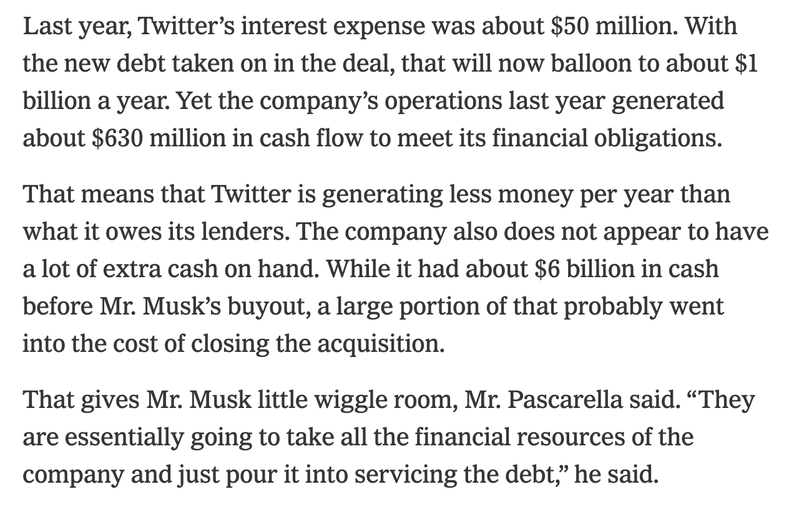

> Lol we're fucked
> https://www.nytimes.com/2022/10/30/technology/elon-musk-twitter-debt.html

> Personally I don't think you should be able to buy a company with money you don't have and need to borrow from elsewhere which then becomes debt belonging to the company you just bought but hey

> A lot of people think that Twitter will be destroyed by memes and unmoderated toxicity, but I actually don't think that'll happen. Instead it will go out the same way as everything else in America: slow and steady deterioration due to unregulated capitalism and leveraged buyouts

https://twitter.com/jasonschreier/status/1587457450311122945

Now that Elon Musk has completed his $44 billion deal for Twitter, let’s walk through the math of owning the social media company.

It’s not just an academic exercise. Mr. Musk’s ability to make the numbers work will have a direct impact on the health of a service called the world’s town square, determining what direction he takes the business and the platform. If the financial case is grim, any plans to invest in Twitter may have to take a back seat to simply paying the bills.

The numbers are already daunting. The $44 billion acquisition was the largest leveraged buyout of a technology company in history. To do the deal, Mr. Musk, the world’s richest man, loaded about $13 billion in debt on the company, which had not turned a profit for eight of the past 10 years. The deal was inked before the global economy looked to be headed toward a recession as interest rates surged higher. And digital advertising, which makes up 90 percent of Twitter’s revenue, has been falling at social media companies.

“Technology companies should be left with enough flexibility to pay for new research and development and new levels of innovation,” said Drew Pascarella, a senior lecturer of finance at Cornell University who previously worked as a banker advising on acquisitions. This buyout “completely eliminates flexibility.”

Twitter and a representative for Mr. Musk did not respond to requests for comment.

Last year, Twitter’s interest expense was about $50 million. With the new debt taken on in the deal, that will now balloon to about $1 billion a year. Yet the company’s operations last year generated about $630 million in cash flow to meet its financial obligations.

That means that Twitter is generating less money per year than what it owes its lenders. The company also does not appear to have a lot of extra cash on hand. While it had about $6 billion in cash before Mr. Musk’s buyout, a large portion of that probably went into the cost of closing the acquisition.

That gives Mr. Musk little wiggle room, Mr. Pascarella said. “They are essentially going to take all the financial resources of the company and just pour it into servicing the debt,” he said.

To make ends meet, Mr. Musk probably has to slash costs — by a lot. Over the weekend, he was said to be already moving to do so by ordering job cuts across Twitter. One investor who put less than $1 million in the buyout of the company said he was told by the head of Mr. Musk’s family office to expect that around 50 percent of Twitter’s 7,500 employees would be laid off.

Mr. Musk could target many areas of Twitter for layoffs. The company has about $1.2 billion in annual sales and marketing expenses, a large portion of which goes to employees’ salaries, benefits and other compensation. But by cutting those costs, he risks getting rid of employees who have relationships with advertisers that would be hard to replace.

Then there is the $1.2 billion that Twitter spends annually on research and development, which also goes mainly to employee compensation. Mr. Musk could cut jobs there, too. But he has said he has grand plans for the site, like combating fake accounts and creating new ways to manage content, which require people to develop those tools. The kinds of engineers Mr. Musk has said he wants to hire are expensive.

There are other paths to slashing costs — like money spent on rent, data centers and additional expenses, which collectively cost the company more than $1 billion a year but may be harder to quickly shed. Unlike traditional targets of leveraged buyouts, Twitter does not clearly have specific businesses to shed or downsize, like a struggling division.

“This has always been the biggest challenge of this particular acquisition,” said Eric Talley, a professor of corporate law at Columbia Law School. “The last thing you want to do is sell off some integral part of what you need to run Twitter on a profitable basis. And then you’ve essentially tied your hands behind your back.”

If even cost cuts do not help, Mr. Musk may need to raise more money from outside investors within a year, Mr. Talley said.

Mr. Musk already has about $13 billion in debt from lenders, while other investors, like the venture capital firms Sequoia Capital and Andreessen Horowitz, chipped in about $7.1 billion in cash. Mr. Musk was personally responsible for the buyout’s remaining roughly $25 billion, and it remains unclear whether he gathered more investors to help lighten that load.

If Twitter needs more money in a year, finding new investors could be a lot to ask given the economics of the company. Even Mr. Musk has conceded that his initial investors in the deal valuing Twitter at $44 billion were “obviously overpaying.” The stocks of many social media companies have tumbled this year as they navigate the same problems as the rest of the economy.

Given his net worth of more than $200 billion, Mr. Musk himself could theoretically help cover Twitter’s extra cash needs. He could also try to buy out some of Twitter’s lenders and reduce its debt load.

But most of his wealth is tied up in shares of his electric vehicle company, Tesla, and its stock has plunged about 40 percent this year. At one point, Mr. Musk tried backing away from buying Twitter, and he may opt not to funnel more money into what would be at least his fifth company.

Putting more money into a leveraged, slow-growth company like Twitter is also not the same as investing in a rapidly growing venture-backed start-up like his rocket-making company, SpaceX. The risks are greater at Twitter because the banks doing the lending care only about getting paid their interest on the day it is owed. Unlike, say, a real estate company, Twitter does not have a large amount of assets to offer lenders as collateral to keep them at bay.

Still, billionaires have sought to prop up beleaguered deals before. The hedge fund manager Eddie Lampert sought to rethink the retail industry and spent billions of his own fortune keeping Sears alive after its failed merger with Kmart in the 2000s. Sears filed for bankruptcy in 2018.

And Mr. Musk has gone into businesses before that naysayers had said were doomed and proved them wrong, like manufacturing electric cars. Twitter has suffered years of mismanagement and may benefit from fixing its business out of the glare of the public markets. Mr. Musk could bring new product ideas and hire engineering experts who might not have wanted to work for Twitter before.

Mr. Musk is “a phenomenal capital allocator, and I think he’ll make a lot of money in Twitter,” said Chamath Palihapitiya, a venture capitalist who was an early Facebook executive. “It doesn’t fit my risk profile. But I think he’s going to be very successful.”

Others caution against the ebullience that initially drove investors to Mr. Musk’s deal, warning that the lure of tech visionaries can fade with market fortunes, especially as global economic fears have mushroomed in recent months.

“At the height of a market boom, those appeals work more easily than they do in times like we are presently entering,” said Robert Bruner, a professor at the Darden School of Business at the University of Virginia and author of the book “Deals From Hell.”

Mr. Bruner said the worst deals are typically struck at the peak of a market — as with Mr. Musk’s purchase of Twitter. He offered what he thought could be a worst-case scenario for the company. In that future, Mr. Musk would not be able to “get the expenses down to the level necessary to cover the debt burden.” That would “slowly erode the company’s equity, and he’s unable to find more equity investors.”

The final outcome? “Slowly, Twitter implodes,” Mr. Bruner said.
