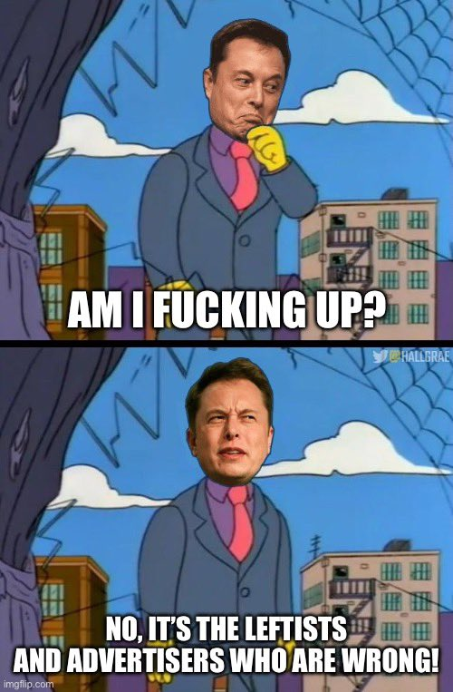

> Twitter has had a massive drop in revenue, due to activist groups pressuring advertisers, even though nothing has changed with content moderation and we did everything we could to appease the activists.Extremely messed up! They’re trying to destroy free speech in America.

https://twitter.com/elonmusk/status/1588538640401018880

> Volkswagen, General Mills, General Motors, Audi and Pfizer have pulled their Twitter advertising..  citing not activists but, essentially, Elon and instability in Twitter takeover.

https://www.bbc.co.uk/news/live/business-63511430?ns_mchannel=social&ns_source=twitter&ns_campaign=bbc_live&ns_linkname=636514a9f15ea55905e40c5a%26Volkswagen%20suspends%20Twitter%20ads%262022-11-04T14%3A51%3A25.970Z&ns_fee=0&pinned_post_locator=urn:asset:6c95c3a8-1730-4f95-a3b1-2197dda45b49&pinned_post_asset_id=636514a9f15ea55905e40c5a&pinned_post_type=share

> When the consequences of being a troll while running Twitter happen.

https://twitter.com/Esqueer_/status/1588547447214989312