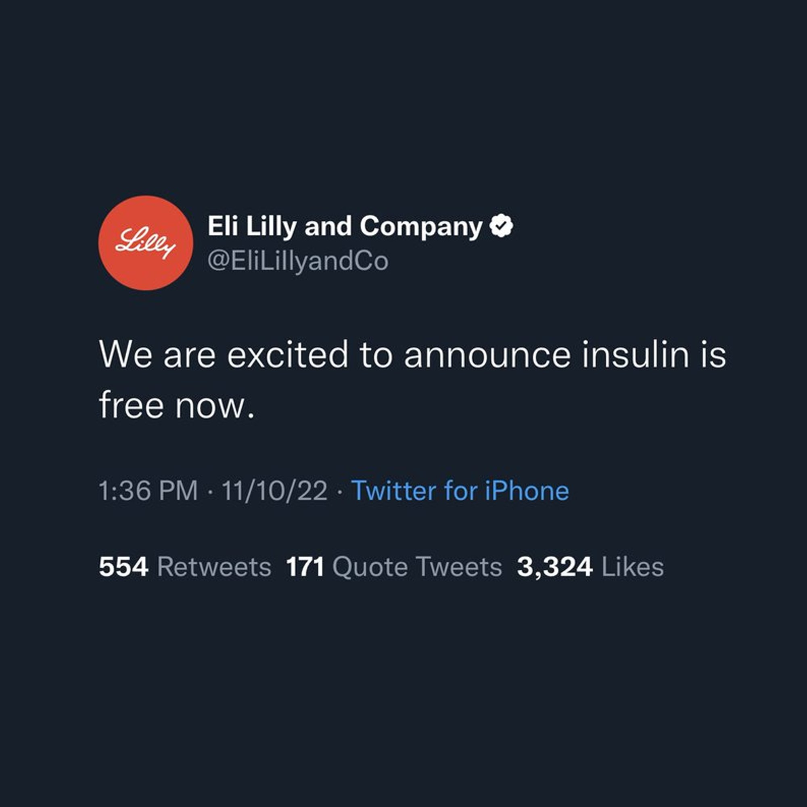
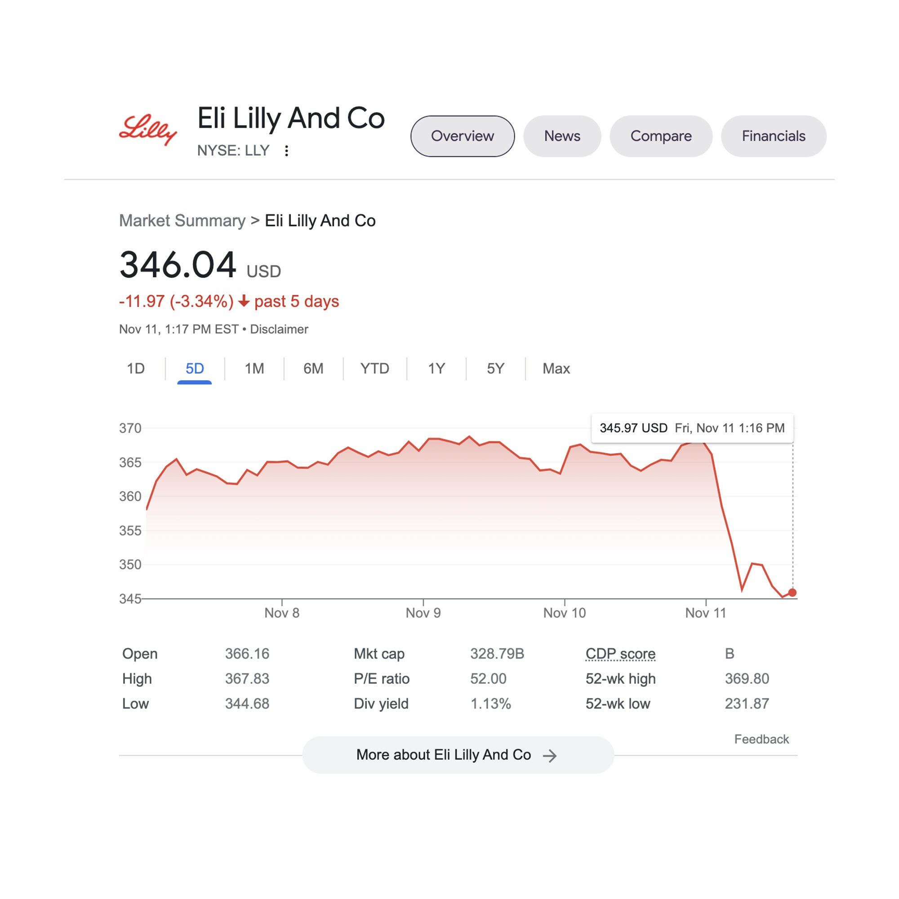
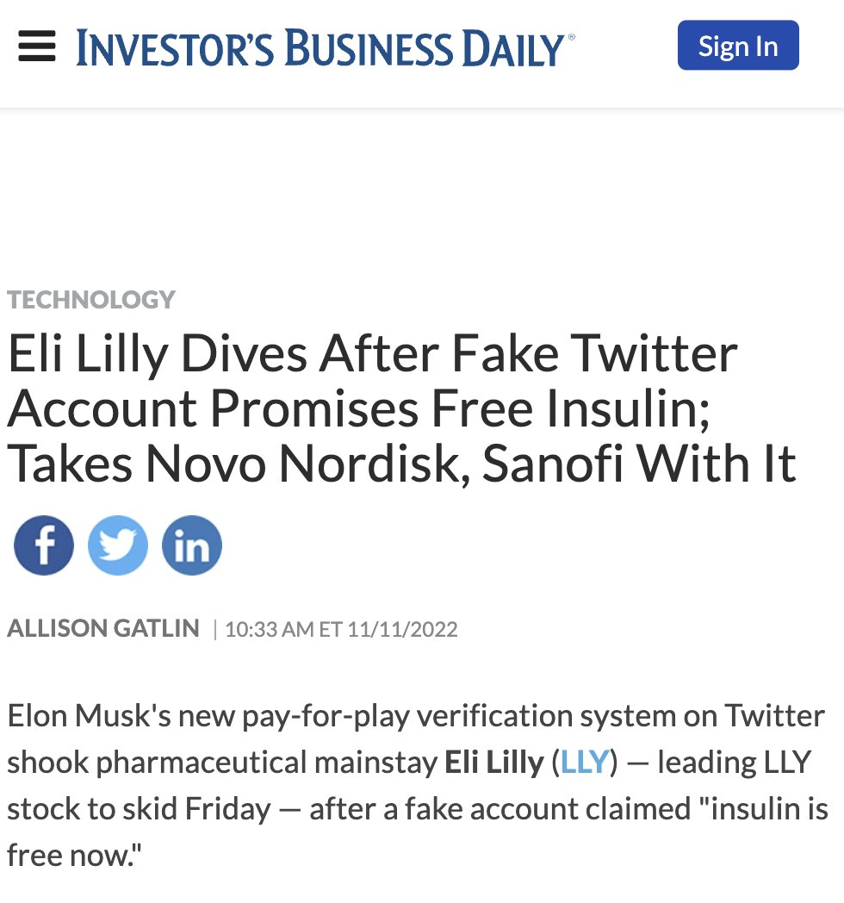
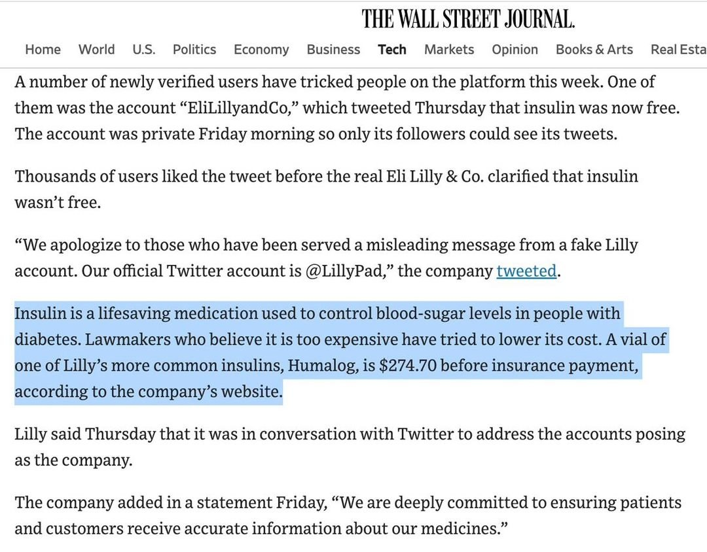

> Did Twitter Blue tweet just cost Eli Lilly $LLY billions? 
> Yes.

https://twitter.com/rafaelshimunov/status/1591133819918114816?s=46&t=zFxoWIp8F9mguld6MkqDfA

> Incredible
https://www.investors.com/news/technology/lly-stock-dives-taking-novo-sanofi-with-it-after-fake-twitter-account-promises-free-insulin/

> We regret to inform you that we will not be giving away insulin, a publicly funded invention that was given away by its creator to be given away to people so they don’t die.

> Eli Lilly stock isn't just tanking because of a satirical Tweet on Musk's hellscape, it's tanking because millions of people are asking why we have to pay for insulin, when it was made to be free.
> That's why other insulin stocks are falling too.
> Happy Disability Awareness Month

> Investors fear culture caught up with them. More people know insulin's discovery was funded with our money. Insulin's cheaper everywhere else.  Insulin's inventors sold the patent for a dollar to a university because they wanted everyone to afford it.

https://www.vox.com/2019/4/3/18293950/why-is-insulin-so-expensive

> Even the Wall Street Journal, not exactly the champion of people over profit, publicly dings Eli Lilly for its immoral price gouging of insulin.

> If you look up the top producers of insulin, more evidence that investors know how vulnerable the insulin grift is. Any news is bad news, because now we're all paying attention.

> Following this and many other parodies of corporations and odious political figures, Elon Musk rushed to turn off his $8 Twitter Blue sign ups and appears to have reintroduced yet ANOTHER badge, further destroying the value of the blue checkmark.