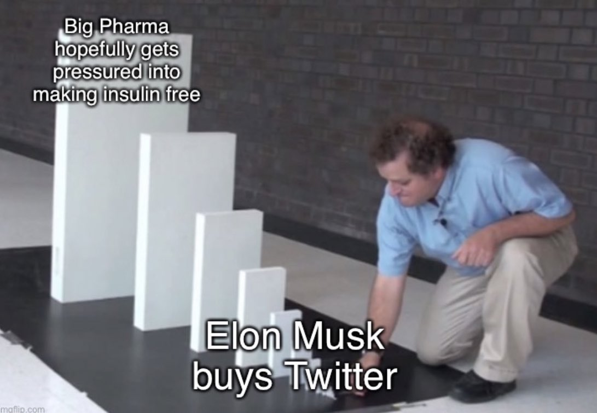

> We’ve got a case study of Twitter blue check imposters impacting an impersonated company’s stock price.
> Remember the Eli Lilly fake verified account tweets yesterday? That impacted their stock quickly.

https://twitter.com/RachelTobac/status/1591160184491364353

> There are many ways that Verified imposter check marks could/will be used. 
> They could be used to short stock, to nosedive their competitions stock by impersonating them and tweeting about all the stuff their PR team can’t stand (insulin should be free btw).

> That sound you’re hearing? That’s the scraping of desks as MBA schools everywhere huddle together to dissect this case study.

> Allowing anyone including hacktivist types to credibly impersonate and pressure big pharma companies to make essential life saving medicine cheap or free and impact their stock price to…own the libs.
> Classic El*n, rock on

> Yes, the stock was impacted later. The impersonation laser focused attention on Eli Lilly, increasing negative sentiment toward the org, especially after LLY’s response. Increased negative sentiment/anger can lead investors to sell & affect competitors too

https://www.investors.com/news/technology/lly-stock-dives-taking-novo-sanofi-with-it-after-fake-twitter-account-promises-free-insulin/