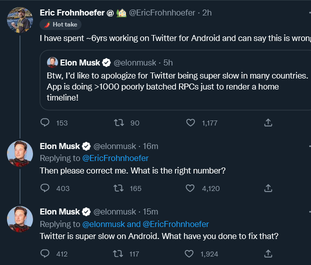

https://mobile.twitter.com/EricFrohnhoefer/status/1591968343229366272

> I think there are three reasons the app is slow. First it’s bloated with features that get little usage. Second, we have accumulated years of tech debt as we have traded velocity and features over perf. Third, we spend a lot of time waiting for network responses.

https://twitter.com/EricFrohnhoefer/status/1591968783148920832?s=20&t=lFj1TnN_hLssllcsQEhhdg

> @langdon @EricFrohnhoefer @pokemoniku He’s fired
https://twitter.com/elonmusk/status/1592186302379982849

