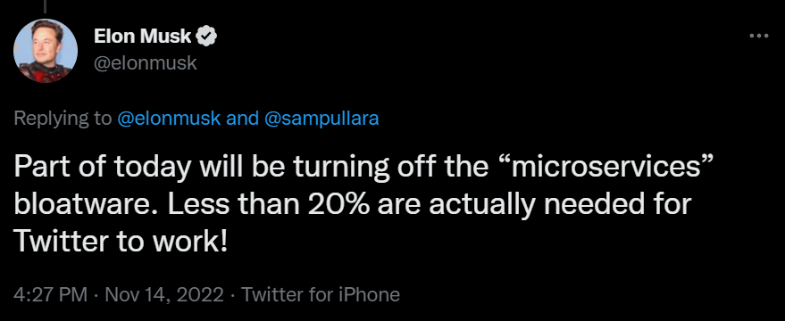

> In his attempt to remove what he's deemed as 'bloatware,' Elon appears to have disabled the microservice responsible for texting users 2FA codes.Users who have logged out are reporting that they are now unable to log back in. https://twitter.com/elonmusk/status/1592177471654604800

> @sampullara Part of today will be turning off the “microservices” bloatware. Less than 20% are actually needed for Twitter to work!
https://twitter.com/MikaelThalen/status/1592259731741380610?t=d9q0CZ8-OsXcah1uQY3ixg&s=09

> Twitter is already slowly breaking, and it's only going to get worse.He says that Twitter was built to be resilient, and that means the core features will continue working even with a reduced workforce.As a former SRE, I disagree with that conclusion. https://twitter.com/GergelyOrosz/status/1591437099496255490

> Scoop from within Twitter: small things are breaking, not enough engineers to fix them.Noticed that notification counts are not showing? The BE service powering it is down since Thursday. A bug was filed, but the team that would fix it is full on with verification work.
https://twitter.com/marcan42/status/1591691423581351937?t=wYwBERf7PoNEUSfGQGbXNA&s=09

